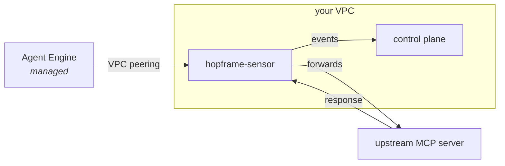
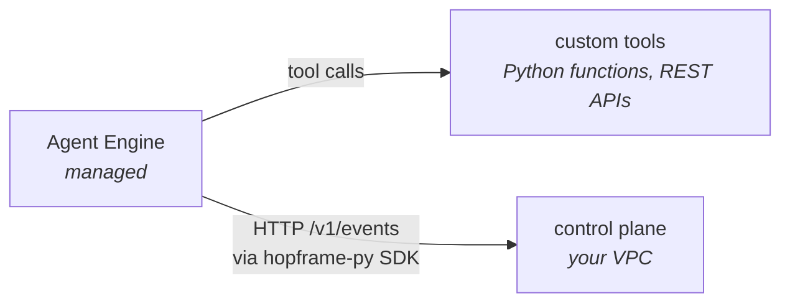

# Hopframe + Vertex AI Agent Engine

Google's [Vertex AI Agent Engine](https://cloud.google.com/vertex-ai/generative-ai/docs/agent-engine) is a managed runtime for deploying LangChain, LangGraph, and custom agents to GCP. As of early-2026 it natively supports MCP tool calling, so most of what Hopframe inspects is already on the wire, you just need to point Agent Engine at the Hopframe sensor instead of directly at your MCP server.

This page describes the two recommended deployment shapes.

---

## Shape 1: HTTP-MCP path (preferred)

When your Agent Engine deployment calls MCP tools over HTTP, configure the tool URLs to go through a Hopframe sensor running in your VPC.



The sensor is the existing `mcp-sensor` binary, deployed via the Helm chart at `deploy/helm/hopframe/`. No Agent Engine code changes required, only the tool configuration changes.

### Step by step

1. **Deploy the control plane and sensor** in a VPC that Agent Engine can reach:

   ```bash
   helm install hopframe ./deploy/helm/hopframe \
     --namespace hopframe --create-namespace \
     --set mcpSensor.upstream.url=http://your-mcp-server.upstream.svc:8080
   ```

   The chart defaults `image.tag` to the chart's `appVersion`. Until v0.1 images are published to GHCR, build and push from this repo (`docker build -t your-registry/hopframe:dev .`) and override `image.repository` and `image.tag` to that.

2. **Set up VPC peering** between Agent Engine's network and your VPC. See [VPC Service Controls for Vertex AI](https://cloud.google.com/vpc-service-controls/docs/supported-products#table_aiplatform).

3. **Update Agent Engine tool config** to point at the sensor's `ClusterIP` service. If you're using LangChain's MCP tooling, the tool URL is what changes:

   ```python
   # Before:
   from mcp_tools import MCPClient
   client = MCPClient("http://your-mcp-server:8080")

   # After:
   client = MCPClient("http://hopframe-sensor.hopframe.svc.cluster.local:7080/mcp")
   ```

4. **Pass the agent run id** so events correlate on the Hopframe timeline:

   ```python
   import uuid
   run_id = f"vae-{uuid.uuid4()}"
   client.call_tool(
       name="fetch",
       arguments={"url": "..."},
       headers={"X-Hopframe-Agent-Run-Id": run_id},
   )
   ```

5. **Deploy the agent** to Agent Engine as you normally would.

That's it. Hopframe's existing detection pipeline, taint tracking, quarantine, and signed audit log all work without further changes.

---

## Shape 2: Python SDK path

When your agent calls tools that are not MCP (direct Python functions, REST APIs, custom tool classes), the wire path cannot see them. Use the Python SDK to emit events directly from LangChain or LangGraph callbacks.



### Step by step

1. Add `hopframe[langchain]` to your Agent Engine deployment's requirements:

   ```toml
   # pyproject.toml or requirements.txt
   hopframe[langchain] >= 0.1
   ```

2. Wire the callback into your agent at construction time:

   ```python
   import os
   from langgraph.prebuilt import create_react_agent
   from hopframe import Hopframe, new_run_id
   from hopframe.integrations.langchain import HopframeCallback

   hf = Hopframe(
       url=os.environ["HOPFRAME_URL"],            # private IP / DNS to your control plane
       api_token=os.environ["HOPFRAME_API_TOKEN"],
       sensor_id="vae-myagent",
   )

   def build_agent():
       cb = HopframeCallback(hf, run_id=new_run_id(), framework="vertex-ae")
       return create_react_agent(model, tools=[...], callbacks=[cb])
   ```

3. **Reach the control plane from Agent Engine.** Either:
   - Deploy the control plane to GCP and use VPC peering or Private Service Connect, or
   - Expose the control plane through an Internal HTTPS Load Balancer that's reachable from Agent Engine's egress.

4. **Set environment variables on the deployment:**

   ```
   HOPFRAME_URL = https://hopframe-cp.internal.example.com
   HOPFRAME_API_TOKEN = <secret>
   ```

5. **Deploy and run.** Events from Python tool calls land on the Hopframe timeline, alongside any MCP traffic flowing through Shape 1.

You can mix both shapes, MCP tools go through the sensor, Python tools emit via the SDK. As long as both share the same `agent_run_id`, the Hopframe UI shows them as a single forensic timeline.

---

## A note on auth

Agent Engine deployments authenticate to GCP services via service accounts. The Hopframe control plane authenticates separately via `HOPFRAME_API_TOKEN`. Treat the token as a secret, store it in Secret Manager, mount it as an env var, never commit it.

For sensor → control-plane mTLS (recommended for production), generate a per-sensor client cert, mount it into the sensor pod from Secret Manager, and configure the paths in the sensor YAML's `emitter.tls` block:

```yaml
emitter:
  sink: http
  url: https://hopframe-cp.internal.example.com
  tls:
    cert_file: /etc/hopframe/tls/client.crt
    key_file: /etc/hopframe/tls/client.key
    ca_file: /etc/hopframe/tls/ca.crt
```

The control plane terminates TLS via the `--tls-cert` / `--tls-key` flags and enforces client-cert auth via `--tls-client-ca`.

---

## What you get

Once either shape is wired up, every Vertex AI Agent Engine deployment using your Hopframe-equipped MCP servers (or the SDK) gives you:

- Live UI showing agent activity in real time
- Cross-protocol agent-run timelines (`/v1/agent-runs/{id}/timeline`)
- Counterparty risk scoring per peer agent
- Cryptographically signed export bundles for compliance
- Quarantine workflow for poisoned tool descriptions
- Cross-protocol taint detection if your agents touch both MCP and A2A

Same Hopframe, different runtime.

---

## Troubleshooting

**Sensor can't reach the upstream MCP server.** Check VPC firewall rules between the sensor's namespace and the upstream service. Hopframe's sensor logs the upstream URL on startup.

**Agent Engine can't reach the sensor.** Verify VPC peering / Private Service Connect is configured and the sensor's `ClusterIP` resolves from Agent Engine's egress.

**Events not appearing in the UI.** Check sensor stderr for emitter errors, most often `HOPFRAME_URL` is wrong or the bearer token doesn't match. Run `make validate VALIDATE_CMD=...` against the sensor to isolate.

**No `agent_run_id` showing up.** Make sure your Agent Engine code sets `X-Hopframe-Agent-Run-Id` (HTTP path) or passes `run_id` to `HopframeCallback` (SDK path). Without it, every request mints a fresh synthetic id and you lose correlation.
