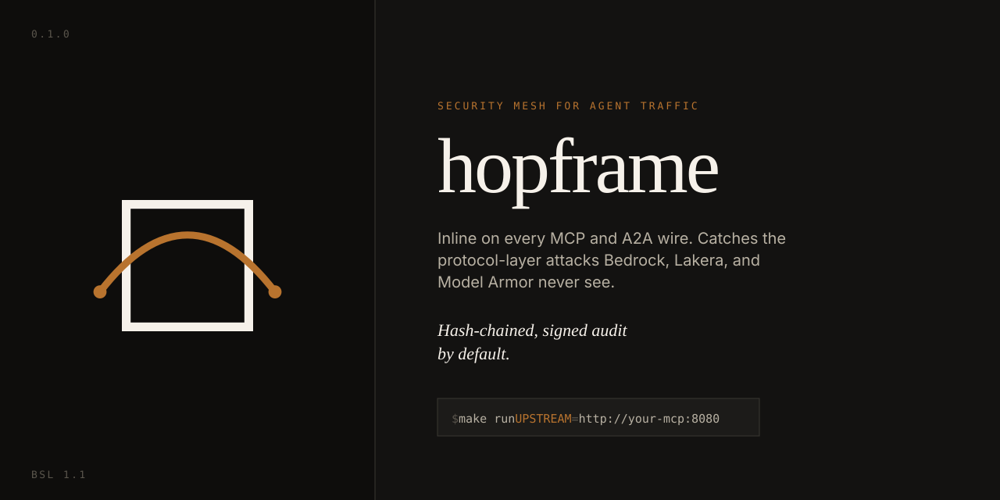

{ .hero-img loading=lazy }

Hopframe is a **security mesh for agent traffic**. It sits inline on the MCP and A2A protocol wires, inspects every JSON-RPC message before it lands, and writes every decision to a tamper-evident, cryptographically signed audit chain.

[How it works](how-it-works.md){ .md-button .md-button--primary }
[Deploy](deploy.md){ .md-button }
[Quick start](deploy.md#quick-start){ .md-button }

## What it is

It catches the attacks model-boundary guardrails never see: poisoned tool descriptions, prompt injection in tool arguments and results, credential and PII exfiltration in tool results, cross-protocol data taint, and A2A task drift.

- **Inline or SDK, one engine.** Deploy the same detection pipeline in front of the server you control, or inside the agent itself. [How it works](how-it-works.md)
- **A tamper-evident audit log.** SHA-256 hash chain, per-record Ed25519 signatures, Merkle proofs, optional Sigstore Rekor anchoring, and offline verification via the `hopframe-export` CLI. [How it works](how-it-works.md#the-audit-chain-and-the-evidence)
- **A control plane you operate.** One HTTP API and CLI for events, policies, sensors, rules, tokens, and users, with multi-tenancy, RBAC, and optional OIDC SSO. [Operations](operations.md) and [Security](security.md)
- **A real detection catalog.** 58 rules across 6 categories, Apache-2.0 licensed, inspectable under `content/`. [How it works](how-it-works.md#what-it-catches)
- **Production shapes built in.** Postgres audit backend, TLS with mutual TLS, retention rotation, SIEM export, Prometheus metrics, and a Helm chart. [Operations](operations.md)

### Get started

What do you control?

- **You control the MCP or A2A server.** Run Hopframe inline in front of it. No agent code changes. [Deploy inline](deploy.md#inline-on-the-wire)
- **The runtime is managed, but you own the agent code.** Use the SDK inside your agent. [Deploy SDK](deploy.md#sdk-inside-your-agent)
- **Just poke at it.** `make demo` runs a cinematic story with bundled stubs, no setup. [Try it](deploy.md#quick-start)

Both paths converge on the same control plane and the same audit log.

### Where it sits

Hopframe is one layer in an agent's defense, positioned to stack with the others:

- **Complements model-boundary guardrails.** It watches the protocol wires those tools never see (tool descriptions, tool results, A2A envelopes, cross-protocol). Pair a prompt/response guardrail with it for that surface.
- **Fits alongside an MCP/agent gateway.** Admission and routing, plus protocol-wire inspection, cover different ground than a perimeter.
- **Ships the evidence.** The tamper-evident audit chain is the piece a model-boundary tool or a plain gateway does not produce.

See the [roadmap](operations.md#roadmap) and [how it works](how-it-works.md#where-it-sits-and-what-is-next) for what is coming next.

> **Status: alpha** under active use. The core pipeline, audit chain, control plane, and CLI are implemented and tested; validate against your real traffic before a regulated workload. See the [roadmap](operations.md#roadmap) for what is next.

## Docs map

| Section | What it answers |
| --- | --- |
| [How it works](how-it-works.md) | What it catches, the four-stage pipeline, taint, the event model, the audit chain. |
| [Deploy](deploy.md) | Run it inline or via SDK, with Docker, Kubernetes, and config. |
| [CLI reference](cli.md) | Every `hopframe` command and flag. |
| [HTTP API reference](api.md) | Every endpoint, auth model, and payload shape. |
| [Configuration](configuration.md) | Environment variables, the YAML config, and the Helm chart values. |
| [Operations](operations.md) | Retention, upgrades, observability, exporters, Postgres, high availability. |
| [Security](security.md) | Auth, RBAC, multi-tenancy, OIDC, TLS, signing, Rekor. |
| [FAQ](faq.md) | Short answers to the common questions. |

## License

The repository as a whole is **Business Source License 1.1** (converts to Apache 2.0 three years after each release). The **detection content** under `content/` and the **benchmark corpus** under `bench/corpus/` are **Apache 2.0 today**. See the [LICENSE](https://github.com/jLuPSP/hopframe/blob/main/LICENSE) and [README](https://github.com/jLuPSP/hopframe) for the full posture.
